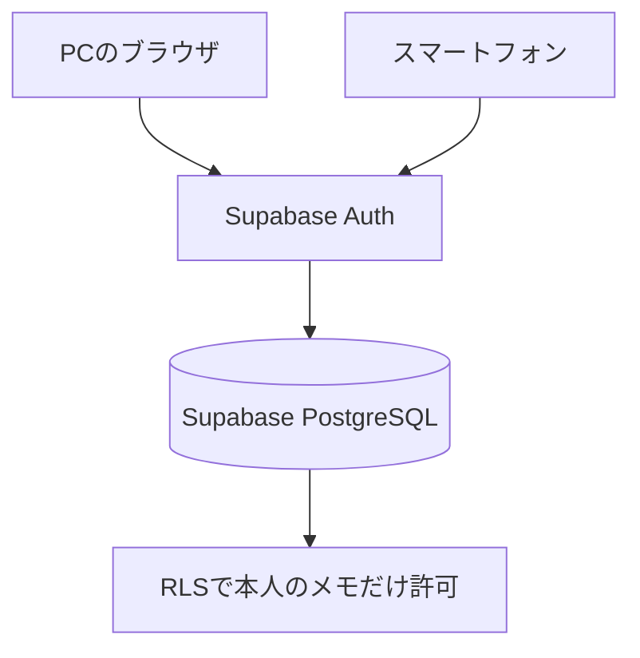

# ことばメモ

失語症のある方が、思い出したい「ことば」や説明を、必要なときにすぐ確認するための個人用PWAです。

データは［日常用］と［PC/Linux用］の大分類に分けて管理します。日常用では、表示番号とカテゴリを別々に管理し、`すべて／マーク`表示やカテゴリで絞り込めます。PC/Linux用では、1つの操作項目に画像＋説明の手順を最大10件まで登録できます。Supabaseを設定すると、同じメールアドレスでログインしたPCとスマートフォンで、両方のデータを利用できます。

公開先：<https://kazunyon.github.io/situgosyou/>

## 主な機能

- メモの登録・編集・削除
- ［日常用］と［PC/Linux用］の大分類切り替え
- PC/Linuxの操作項目ごとに、画像＋説明を最大10手順まで登録
- Snipping Toolで切り取った画像を、ファイル保存せずクリップボードから直接貼り付け
- 各メモの表示番号とカテゴリを独立して管理
- 最大10件まで追加・名称変更できるカテゴリマスター
- タイトルと意味・説明の検索
- 大切なメモへの星マーク
- 日本語の音声入力（対応ブラウザのみ）
- Supabaseを使ったPC・スマートフォン間の同期
- メールに届く6桁の確認コードによるパスワード不要ログイン
- メモとカテゴリをJSONファイルへバックアップ・復元
- ホーム画面へ追加できるPWA
- RLS（行レベルセキュリティ）による利用者ごとのデータ分離

## データの保存場所

Supabaseの設定の有無によって、保存場所が変わります。

| 動作モード | 保存場所 | PC・スマホ同期 | ログイン |
| --- | --- | --- | --- |
| 端末内の試作モード | ブラウザの`localStorage` | できません | 不要 |
| Supabase同期モード | SupabaseのPostgreSQL | できます | 必要 |

画面に「いまはこの端末だけの試作モードです」と表示される場合は、Supabaseがまだ設定されていません。

端末内の試作モードで作成したメモは、Supabase設定後に自動転送されません。残したいメモがある場合は、設定前に **設定 → バックアップ** でJSONファイルへ保存し、Supabaseへログインした後に **バックアップを戻す** を実行してください。



## 最初に用意するもの

- Git
- Node.js 20系とnpm
- GitHubアカウント
- Supabaseアカウント
- 6桁の確認コードを受信できるメールアドレス

## 1. ソースコードをPCへ取得する

PowerShellを開き、次を実行します。

```powershell
cd C:\home\github
git clone https://github.com/kazunyon/situgosyou.git
cd situgosyou
npm install
```

すでに取得済みの場合は、次のように最新化します。

```powershell
cd C:\home\github\situgosyou
git pull origin main
npm install
```

## 2. Supabaseプロジェクトを作成する

Supabaseは、メモを保存するPostgreSQL、ログイン機能、Webアプリから利用するAPIをまとめて提供します。このアプリでは、SupabaseをPC・スマートフォン共通の保存先として使用します。

1. [Supabase](https://supabase.com/)を開き、ログインします。
2. Dashboardで **New project** を選びます。
3. 次の内容を入力します。

| 項目 | 設定例 | 説明 |
| --- | --- | --- |
| Organization | `situgosyou Org` | プロジェクトを管理する入れ物です。既存Organizationでも構いません。 |
| Project name | `situgosyou` | Supabase上のプロジェクト名です。 |
| Database Password | 自動生成した強いパスワード | GitHubやREADMEへ書かず、安全な場所へ保管します。 |
| Region | 日本に近いリージョン | 選択肢に東京があれば東京を選びます。 |
| Pricing Plan | Freeなど | 利用目的に合うプランを選びます。 |

4. **Create new project** を押します。
5. データベースの準備が完了し、プロジェクト画面が開くまで待ちます。

Database Passwordは、このWebアプリの環境変数には設定しません。ただし、将来データベースへ直接接続するときに必要になるため、紛失しないよう保管してください。

## 3. メモ用テーブルとRLSを作成する

リポジトリの [`supabase/schema.sql`](supabase/schema.sql) をSupabaseのSQL Editorで実行します。

1. Supabase Dashboardで対象プロジェクトを開きます。
2. 左側の **SQL Editor** を開きます。
3. **New query** を選びます。
4. [`supabase/schema.sql`](supabase/schema.sql) の内容をすべてコピーし、SQL Editorへ貼り付けます。
5. **Run** を押します。
6. 左側の **Table Editor** を開き、`public.memos`テーブルがあることを確認します。

このSQLは、次の内容を設定します。

- `memos`テーブルの作成
- 利用者を識別する`user_id`の保存
- RLS（行レベルセキュリティ）の有効化
- 参照・登録・更新・削除を本人のメモだけに制限するポリシー
- メモ一覧を効率よく表示するためのインデックス

RLSは重要です。ブラウザで利用するキーが分かっても、ログイン中の利用者は`memos.user_id = auth.uid()`に一致する自分のメモだけを操作できます。

### すでにSupabaseを利用している場合

表示番号とカテゴリを追加するため、アプリを公開する前に移行SQLを実行します。既存のメモは削除されません。

1. Supabase Dashboardで対象プロジェクトを開きます。
2. 左側の **SQL Editor** で **New query** を選びます。
3. まだ表示番号のSQLを実行していない場合は、[`20260822000000_add_display_number.sql`](supabase/migrations/20260822000000_add_display_number.sql) の内容を貼り付けて **Run** を押します。
4. 続いて、[`20260822010000_add_category_number.sql`](supabase/migrations/20260822010000_add_category_number.sql) の内容を新しいクエリへ貼り付けて **Run** を押します。
5. 続いて、[`20260903000000_add_pc_linux_guides.sql`](supabase/migrations/20260903000000_add_pc_linux_guides.sql) の内容を新しいクエリへ貼り付けて **Run** を押します。
6. エラーが表示されなければ完了です。既存のメモは日常用・カテゴリ1のまま保持され、PC/Linux用の画像付き手順を保存できるようになります。

## 4. 6桁の確認コードをメールで送る設定

このアプリは、パスワードやMagic Linkの代わりに、メールへ届く6桁の確認コード（OTP）を使います。スマートフォンでメールのリンクを開く必要がないため、Googleアプリや別のブラウザへ移動せず、ホーム画面の「ことばメモ」でログインを完了できます。

この変更にSQLの実行は必要ありません。Supabase Dashboardのメールテンプレートを、次の手順で1回だけ変更します。

1. Supabase Dashboardで対象プロジェクトを開きます。
2. **Authentication → Providers** または **Sign In / Providers** を開き、**Email** が有効になっていることを確認します。
3. **Authentication → Email Templates** を開きます。
4. **Magic Link** テンプレートを選びます。Supabaseでは、Magic LinkとメールOTPが同じテンプレートを使用します。
5. Subject（件名）を、例えば `ことばメモ ログイン確認コード` に変更します。
6. Body（本文）を、[`supabase/email-templates/login-otp.html`](supabase/email-templates/login-otp.html) の内容にすべて置き換えます。
7. 本文に `{{ .Token }}` があり、`{{ .ConfirmationURL }}` が残っていないことを確認します。
8. **Save changes** または **Save** を押します。

`{{ .Token }}`が、利用者ごとに発行される6桁の数字へ置き換わります。`{{ .ConfirmationURL }}`が残っているとリンク型のメールになるため、必ず本文を置き換えてください。

続いて、**Authentication → URL Configuration** を開き、**Site URL** に次を登録します。

```text
https://kazunyon.github.io/situgosyou/
```

ローカル環境も使用する場合は、**Redirect URLs** に次の2件を追加します。

```text
http://localhost:5173/
https://kazunyon.github.io/situgosyou/
```

URL末尾の`/`も含めて登録し、設定を保存します。6桁コードの入力ではリンク先へ移動しませんが、Supabase Authの基本設定として正しいURLを登録しておきます。

## 5. Project URLとPublishable keyを取得する

1. Supabase Dashboardで対象プロジェクトを開きます。
2. 画面上部の **Connect** を開きます。見つからない場合は **Settings → API Keys** を開きます。
3. 次の2つを控えます。

| 必要な値 | 形式の例 | 用途 |
| --- | --- | --- |
| Project URL | `https://xxxxxxxx.supabase.co` | 接続先のSupabaseプロジェクト |
| Publishable key | `sb_publishable_...` | ブラウザからSupabaseへ接続する公開用キー |

このリポジトリでは互換性のため環境変数名が`VITE_SUPABASE_ANON_KEY`になっていますが、値には現在推奨されている **Publishable key** を設定できます。

> `service_role`キーや`sb_secret_...`で始まるSecret keyは、絶対に設定しないでください。これらはRLSを回避できるサーバー専用の秘密情報で、ブラウザやGitHub Pagesへ公開してはいけません。

## 6. PCの開発環境へSupabaseを設定する

プロジェクトのルートで、`.env.example`を`.env.local`へコピーします。

```powershell
Copy-Item .env.example .env.local
notepad .env.local
```

`.env.local`を次のように編集します。

```dotenv
VITE_SUPABASE_URL=https://xxxxxxxx.supabase.co
VITE_SUPABASE_ANON_KEY=sb_publishable_xxxxxxxxxxxxxxxx
```

設定後、開発サーバーを起動します。

```powershell
npm run dev
```

ブラウザで次を開きます。

<http://localhost:5173/>

`.env.local`は`.gitignore`に登録されています。秘密情報ではないPublishable keyであっても、環境ごとの設定ファイルとしてGitHubへコミットしないでください。

## 7. PCでログインして動作を確認する

1. 画面の **PCとスマホで同期** にメールアドレスを入力します。
2. **6桁のコードを送る** を押します。
3. 受信したメールに表示される6桁の数字を確認します。メール内のリンクを開く操作はありません。
4. 「ことばメモ」の画面に戻り、6桁の数字を入力します。
5. **コードを確認してログイン** を押します。
6. 「メールアドレス で同期中」と表示されることを確認します。
7. **新しく書く** から確認用のメモを1件保存します。
8. Supabase Dashboardの **Table Editor → memos** に、保存した行が追加されたことを確認します。

メールが届かない場合は、迷惑メールフォルダーも確認してください。コードを再送すると新しいコードが発行されるため、最後に届いたメールのコードを入力します。

## 8. GitHub Pagesへ公開する

このリポジトリには、GitHub Pagesへ自動公開するGitHub Actions workflowが含まれています。

### 8-1. GitHub Pagesの公開方法を設定する

1. GitHubで`kazunyon/situgosyou`を開きます。
2. **Settings → Pages** を開きます。
3. **Build and deployment → Source** で **GitHub Actions** を選びます。

### 8-2. Supabaseの値をGitHub Actionsへ登録する

現在のworkflowはGitHub Actionsの **Secrets** を読み込みます。**Variablesではありません。**

1. **Settings → Secrets and variables → Actions** を開きます。
2. **Secrets** タブを選びます。
3. **New repository secret** を押し、次の2件を登録します。

| Secret名 | 設定する値 |
| --- | --- |
| `VITE_SUPABASE_URL` | SupabaseのProject URL |
| `VITE_SUPABASE_ANON_KEY` | SupabaseのPublishable key |

4. `main`ブランチへ変更を反映すると、workflowが自動でビルドと公開を行います。
5. GitHubの **Actions** タブで、**Deploy to GitHub Pages** が緑色のチェックになったことを確認します。
6. <https://kazunyon.github.io/situgosyou/> を開きます。

Secretを変更しただけでは、すでに公開済みの画面は自動で再ビルドされない場合があります。その場合は、**Actions → Deploy to GitHub Pages → Run workflow** から再実行してください。

## 9. PCとスマートフォンを同期する

PCとスマートフォンでは、必ず同じメールアドレスでログインします。

### PC側

1. <https://kazunyon.github.io/situgosyou/> をPCで開きます。
2. 同期に使うメールアドレスを入力します。
3. PCで受信メールを確認し、6桁のコードを「ことばメモ」へ入力します。
4. **コードを確認してログイン** を押します。
5. メモを1件保存します。

### スマートフォン側

1. 同じ公開URLをスマートフォンで開きます。
2. PCと同じメールアドレスを入力します。
3. スマートフォンで受信メールを確認します。
4. ホーム画面の「ことばメモ」に戻り、6桁のコードを入力します。
5. **コードを確認してログイン** を押します。
6. PCで作成したメモが表示されることを確認します。
7. スマートフォンでメモを追加し、PCでも確認します。

確認コードは端末ごとに入力します。PCとスマートフォンの両方をログイン状態にする場合は、それぞれの端末で同じメールアドレスを入力し、その都度メールに届いた最新の6桁コードを使用してください。

このアプリは、起動時・ログイン時にSupabaseから最新のメモを読み込みます。片方の端末ですでに画面を開いたまま、もう片方で変更した場合は、開いている側の画面を再読み込みするか、アプリをいったん閉じて開き直してください。

## 10. スマートフォンのホーム画面へ追加する

### iPhone・iPad（Safari）

1. Safariで<https://kazunyon.github.io/situgosyou/>を開きます。
2. 共有ボタンを押します。
3. **ホーム画面に追加** を選びます。
4. **追加** を押します。

### Android（Chrome）

1. Chromeで公開URLを開きます。
2. 右上のメニューを開きます。
3. **アプリをインストール** または **ホーム画面に追加** を選びます。
4. 画面の案内に従います。

## バックアップと復元

画面右上の設定から利用できます。

- **バックアップ**：現在のメモとカテゴリをJSONファイルへ保存します。
- **バックアップを戻す**：JSONファイルの内容で、現在のメモとカテゴリを置き換えます。

Supabase同期モードではログイン後に利用できます。復元は現在のメモとカテゴリを置き換えるため、実行前に確認画面の件数を確認してください。カテゴリ情報を含まない旧形式のバックアップも復元でき、その場合は現在のカテゴリ設定が保持されます。

## セキュリティ

- `public.memos`ではRLSを有効にしています。
- 各行の`user_id`とログイン利用者の`auth.uid()`が一致する場合だけ操作できます。
- Publishable keyはブラウザ用ですが、RLSとセットで使用することが前提です。
- `service_role`キー、Secret key、Database PasswordはGitHubへ保存しません。
- `.env.local`はGitの管理対象外です。

## データ項目

| 画面上の項目 | DB列 | 内容 |
| --- | --- | --- |
| ID | `id uuid` | メモを一意に識別します。 |
| 利用者 | `user_id uuid` | Supabase Authの利用者IDです。 |
| 大分類 | `section varchar(20)` | `daily`（日常用）または`pc-linux`（PC/Linux用）です。 |
| 表示番号 | `display_number integer` | `すべて`の一覧で表示・並び替えに使う1〜9999の番号です。 |
| カテゴリ番号 | `category_number integer` | 表示番号とは独立し、カテゴリマスターの番号を保存します。 |
| タイトル | `title varchar(255)` | 必須項目です。 |
| 意味・説明 | `meaning varchar(2000)` | 思い出すための説明です。 |
| 操作手順 | `steps jsonb` | PC/Linux用の画像＋説明を最大10件保存します。 |
| マーク | `marked char(1)` | `★`または空文字です。 |
| 削除フラグ | `deleted boolean` | 画面から削除した状態を管理します。 |
| 作成日時 | `created_at timestamptz` | 作成した日時です。 |
| 更新日時 | `updated_at timestamptz` | 最後に変更した日時です。 |

カテゴリ名は`memo_categories`テーブルで利用者ごとに管理します。番号と名前の初期値は`1 自然`、`2 乗り物`、`3 AI`です。

## よくある問題

| 症状 | 確認すること |
| --- | --- |
| 「この端末だけの試作モード」と表示される | PCでは`.env.local`、GitHub PagesではActions Secretsの2項目を確認し、再ビルドします。 |
| 6桁コードのメールが届かない | メールアドレス、迷惑メール、SupabaseのEmail Provider、短時間の連続送信制限を確認します。 |
| メールに6桁コードではなくリンクが届く | **Authentication → Email Templates → Magic Link** の本文を確認し、`{{ .ConfirmationURL }}`を削除して`{{ .Token }}`を使用します。 |
| 6桁コードを入力してもログインできない | 数字が6桁か、最新のメールに記載されたコードか、有効期限内かを確認します。再送した場合は古いコードを使いません。 |
| PCとスマートフォンで違うメモが表示される | 両方が同じメールアドレスでログイン中か確認します。片方を再読み込みします。 |
| GitHub Pagesへ設定が反映されない | Actions Secretsの名前を確認し、Deploy workflowを再実行します。 |
| `memos`が見つからない | SupabaseのSQL Editorで`supabase/schema.sql`を最後まで実行したか確認します。 |
| 保存時に権限エラーになる | ログイン状態、`memos`のRLS有効化、4つのRLSポリシーを確認します。Data APIの公開設定を変更している場合は`public`スキーマの設定も確認します。 |
| スマートフォンで古い画面が出る | PWAを閉じて開き直すか、ブラウザで再読み込みします。 |

## 開発用コマンド

| コマンド | 内容 |
| --- | --- |
| `npm install` | 必要なパッケージをインストールします。 |
| `npm run dev` | 開発サーバーを起動します。 |
| `npm run build` | TypeScriptの確認と本番ビルドを行います。 |
| `npm run preview` | ビルド結果をローカルで確認します。 |

## 技術構成

- React 18
- TypeScript 5.6
- Vite 5
- vite-plugin-pwa
- Supabase JavaScript Client 2
- Supabase Auth
- Supabase PostgreSQL
- GitHub Pages
- GitHub Actions
