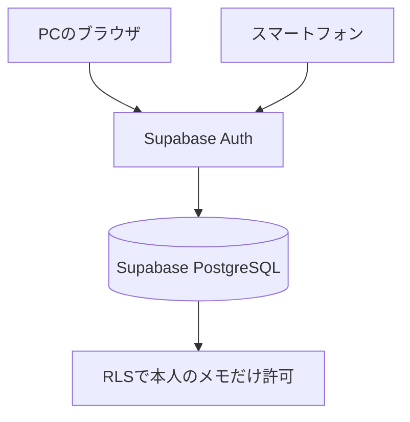

# ことばメモ インストール手順書

アプリの概要と主な機能は[README](../README.md)をご覧ください。

## Supabaseを使わず、端末内に保存して使う

GitHub Pagesからアプリを配信し、メモとカテゴリはPC・スマートフォンそれぞれのブラウザ内に保存できます。Supabaseへのログインは不要です。PCとスマートフォンの両方でPWAとして利用でき、自分でサーバーやデータベースを用意・管理する必要はありません。

GitHub Pagesは、アプリの画面やファイルを届けるために使います。端末内モードのメモはGitHub PagesやSupabaseへ送信されません。ただし、**PCとスマートフォンのメモは別々に保存され、自動同期されません。** PCで追加したメモをスマートフォンでも使いたいときは、バックアップファイルを手動で移します。

この方法で使う場合は、以下の手順を進めてください。後半の「1. ソースコードをPCへ取得する」から「9. PCとスマートフォンを同期する」までは、Supabaseで自動同期する場合の手順です。

### 1. 今あるメモをバックアップする

すでにSupabaseでメモを保存している場合は、設定を切り替える前にバックアップを取ります。Supabaseのメモは、端末内へ自動では移りません。

PCとスマートフォンの両方で、次の操作を行います。

1. 今の「ことばメモ」を、インターネットにつないだ状態で開きます。
2. メモが保存されているメールアドレスでログインし、残したいメモが表示されることを確認します。
3. 画面下の **設定** をクリック、またはタップします。
4. **バックアップ** を押します。
5. `ことばメモ_バックアップ_日付.json` が、その端末に保存されたことを確認します。

PCでは通常「ダウンロード」フォルダー、スマートフォンでは「ファイル」アプリなどから確認できます。端末ごとにバックアップを保存しておくと、切り替え後に端末間でファイルを移さず復元できます。まだメモを作っていない場合、この手順は不要です。

### 2. GitHub Pagesの公開先を確認する

1. GitHubで [kazunyon/situgosyou](https://github.com/kazunyon/situgosyou) を開きます。
2. **Settings** をクリックします。
3. 左側の **Pages** をクリックします。
4. **Build and deployment → Source** が **GitHub Actions** になっていることを確認します。

公開URLは <https://kazunyon.github.io/situgosyou/> です。端末内モードでも同じURLを使います。

### 3. GitHub ActionsのSupabase設定を外す

公開処理の [deploy-pages.yml](../.github/workflows/deploy-pages.yml) は、GitHub ActionsのSecretsからSupabaseの接続設定を読み込みます。端末内モードで公開するため、次の2件を公開処理に渡さない状態にします。

- `VITE_SUPABASE_URL`
- `VITE_SUPABASE_ANON_KEY`

設定を削除する前に、手順1のバックアップが保存されていることを確認してください。

1. リポジトリの **Settings** をクリックします。
2. **Secrets and variables → Actions** を開きます。
3. **Secrets** タブをクリックします。
4. **Repository secrets** に上記の名前があれば、それぞれの削除ボタンを押し、確認画面で削除します。
5. **Settings → Environments → github-pages** も開きます。
6. **Environment secrets** に同じ名前があれば、こちらも削除します。

最初からこの2件を登録していない場合、削除操作は不要です。両方の場所を確認するのは、片方に設定が残っていると公開処理で使われるためです。

この操作で削除するのはGitHub Actionsの接続設定です。Supabaseのプロジェクト、利用者、保存済みメモは削除されません。接続設定の値を再登録できるよう、Supabaseのプロジェクトは手元のメモの復元が済むまで保持してください。

PCの開発用ファイル `.env.local` はGitHubへ送られないため、通常のGitHub Pages公開には使われません。PCで `npm run dev` や `npm run build` を実行して端末内モードを使う場合は、`.env.local` 内の上記2項目も空にして保存します。

GitHubのSecretsの場所については [GitHub公式手順](https://docs.github.com/en/actions/how-tos/write-workflows/choose-what-workflows-do/use-secrets) も参照できます。

### 4. 端末内モードで公開し直す

Secretsの削除だけでは、公開中のアプリは切り替わりません。新しい設定でビルドと公開を行います。

1. リポジトリ上部の **Actions** をクリックします。
2. 左側の **Deploy to GitHub Pages** をクリックします。
3. **Run workflow** をクリックします。
4. ブランチが **main** になっていることを確認します。
5. 表示された実行ボタン **Run workflow** をクリックします。
6. 新しい実行結果が緑色のチェックになるまで待ちます。

再公開の操作は [GitHub公式手順](https://docs.github.com/en/actions/how-tos/manage-workflow-runs/manually-run-a-workflow) でも確認できます。

公開が終わったら、PCとスマートフォンをインターネットにつなぎ、アプリを開き直します。古い画面が出る場合は、ブラウザの再読み込みボタンを押し、PWAもいったん閉じて開き直してください。**「いまはこの端末だけの試作モードです」** と表示され、ログイン欄が表示されなくなったら、端末内モードへ切り替わっています。

### 5. 各端末へメモを戻す

PCとスマートフォンの両方で、次の操作を行います。

1. 端末内モードの「ことばメモ」を開きます。
2. 画面下の **設定** をクリック、またはタップします。
3. **バックアップを戻す** を押します。
4. 手順1で、その端末に保存したJSONファイルを選びます。
5. 確認画面の件数を確認し、復元を進めます。
6. 日常用、PC/Linux用、カテゴリが戻ったことを確認します。

**復元は、その端末の現在のメモとカテゴリを置き換えます。** 以前に端末内モードを使ったデータが残っている場合、それを残すには復元前に別のバックアップを取ってください。

どちらの端末にも同じバックアップを戻した場合、復元直後は同じ内容になります。その後の追加・編集・削除は、操作した端末だけに反映されます。

### 6. PWAとして使う

PCでは公開URLをEdgeまたはChromeで開き、アドレスバー付近のインストールボタンからインストールします。スマートフォンでは、後半の「10. スマートフォンのホーム画面へ追加する」の手順で追加します。すでに同じ公開URLからインストールしている場合は、再公開された内容へ更新して使います。

初回の読み込み、インストール、アプリの更新にはインターネット接続が必要です。アプリ本体が端末に保存された後は、オフラインでもメモの表示・追加・編集・削除ができます。Wikipediaの「意味・説明」取得には通信が必要です。音声入力や読み上げも、ブラウザや端末の音声によって通信が必要になる場合があります。

メモはその端末のブラウザ内（`localStorage`）に保存されます。別のブラウザ、別のブラウザのプロフィール、別の端末では同じ保存内容を使えません。ブラウザのサイトデータ削除や端末の初期化に備え、重要な変更の後は **設定 → バックアップ** でJSONファイルを保存してください。画像を多く登録するとブラウザの保存容量に達する場合があるため、保存エラーが出た場合はバックアップを取り、画像の大きさや件数を見直します。

### PCとスマートフォンの内容を手動でそろえる

1. 最新の内容がある端末で **設定 → バックアップ** を押します。
2. 保存したJSONファイルを、USB接続など、使いやすい方法でもう一方の端末へ移します。
3. もう一方の端末で **設定 → バックアップを戻す** を押し、そのファイルを選びます。

この方法は差分の自動同期や、両方の変更の結合ではありません。バックアップの内容で置き換えるため、両方の端末で別々に編集した場合は、復元前にそれぞれの内容をバックアップしてください。普段はPCで編集し、スマートフォンは閲覧中心にすると、どちらが最新か判断しやすくなります。

## SupabaseでPCとスマートフォンを自動同期する場合

ここから「9. PCとスマートフォンを同期する」までは、Supabaseを共通の保存先として使う場合の手順です。端末内モードで使う場合は、この設定は不要です。

Supabase同期モードでは、メモやカテゴリの保存・変更時にSupabaseへ直接送信します。オフライン中の変更を端末へ保留し、オンライン復帰後に自動送信する機能はありません。通信できない状態で保存に失敗した場合、その変更は保存されていないため、通信が回復してからもう一度保存してください。重要なデータは定期的にバックアップしてください。

端末内モードで作成したメモは、Supabase設定後に自動転送されません。自動同期へ切り替えるときは、設定前に **設定 → バックアップ** でJSONファイルへ保存し、Supabaseへログインした後に **バックアップを戻す** を実行してください。復元先のSupabaseのメモとカテゴリも置き換わるため、既存データがある場合は先にバックアップを取ります。



## 自動同期を設定するために用意するもの

- Git
- Node.js 20系とnpm
- GitHubアカウント
- Supabaseアカウント
- 6桁の確認コードを受信できるメールアドレス

## 1. ソースコードをPCへ取得する

PowerShellを開き、次を実行します。

```powershell
cd C:\home\github
git clone https://github.com/kazunyon/situgosyou.git
cd situgosyou
npm install
```

すでに取得済みの場合は、次のように最新化します。

```powershell
cd C:\home\github\situgosyou
git pull origin main
npm install
```

## 2. Supabaseプロジェクトを作成する

Supabaseは、メモを保存するPostgreSQL、ログイン機能、Webアプリから利用するAPIをまとめて提供します。このアプリでは、SupabaseをPC・スマートフォン共通の保存先として使用します。

1. [Supabase](https://supabase.com/)を開き、ログインします。
2. Dashboardで **New project** を選びます。
3. 次の内容を入力します。

| 項目 | 設定例 | 説明 |
| --- | --- | --- |
| Organization | `situgosyou Org` | プロジェクトを管理する入れ物です。既存Organizationでも構いません。 |
| Project name | `situgosyou` | Supabase上のプロジェクト名です。 |
| Database Password | 自動生成した強いパスワード | GitHubやREADMEへ書かず、安全な場所へ保管します。 |
| Region | 日本に近いリージョン | 選択肢に東京があれば東京を選びます。 |
| Pricing Plan | Freeなど | 利用目的に合うプランを選びます。 |

4. **Create new project** を押します。
5. データベースの準備が完了し、プロジェクト画面が開くまで待ちます。

Database Passwordは、このWebアプリの環境変数には設定しません。ただし、将来データベースへ直接接続するときに必要になるため、紛失しないよう保管してください。

## 3. メモ用テーブルとRLSを作成する

リポジトリの [`supabase/schema.sql`](../supabase/schema.sql) をSupabaseのSQL Editorで実行します。

1. Supabase Dashboardで対象プロジェクトを開きます。
2. 左側の **SQL Editor** を開きます。
3. **New query** を選びます。
4. [`supabase/schema.sql`](../supabase/schema.sql) の内容をすべてコピーし、SQL Editorへ貼り付けます。
5. **Run** を押します。
6. 左側の **Table Editor** を開き、`public.memos`テーブルがあることを確認します。

このSQLは、次の内容を設定します。

- `memos`テーブルの作成
- 利用者を識別する`user_id`の保存
- RLS（行レベルセキュリティ）の有効化
- 参照・登録・更新・削除を本人のメモだけに制限するポリシー
- メモ一覧を効率よく表示するためのインデックス

RLSは重要です。ブラウザで利用するキーが分かっても、ログイン中の利用者は`memos.user_id = auth.uid()`に一致する自分のメモだけを操作できます。

### すでにSupabaseを利用している場合

表示番号、カテゴリ、表示順などを追加するため、アプリを公開する前に移行SQLを実行します。既存のメモは削除されません。

1. Supabase Dashboardで対象プロジェクトを開きます。
2. 左側の **SQL Editor** で **New query** を選びます。
3. まだ表示番号のSQLを実行していない場合は、[`20260822000000_add_display_number.sql`](../supabase/migrations/20260822000000_add_display_number.sql) の内容を貼り付けて **Run** を押します。
4. 続いて、[`20260822010000_add_category_number.sql`](../supabase/migrations/20260822010000_add_category_number.sql) の内容を新しいクエリへ貼り付けて **Run** を押します。
5. 続いて、[`20260903000000_add_pc_linux_guides.sql`](../supabase/migrations/20260903000000_add_pc_linux_guides.sql) の内容を新しいクエリへ貼り付けて **Run** を押します。
6. 続いて、[`20260909045710_add_memo_sort_order.sql`](../supabase/migrations/20260909045710_add_memo_sort_order.sql) の内容を新しいクエリへ貼り付けて **Run** を押します。
7. 続いて、[`20260910224038_add_memo_title_color.sql`](../supabase/migrations/20260910224038_add_memo_title_color.sql) の内容を新しいクエリへ貼り付けて **Run** を押します。
8. エラーが表示されなければ完了です。既存のメモの番号と内容を保ったまま、一覧の表示順変更とタイトルの色分けができるようになります。既存タイトルの色は黒です。

## 4. 6桁の確認コードをメールで送る設定

このアプリは、パスワードやMagic Linkの代わりに、メールへ届く6桁の確認コード（OTP）を使います。スマートフォンでメールのリンクを開く必要がないため、Googleアプリや別のブラウザへ移動せず、ホーム画面の「ことばメモ」でログインを完了できます。

この変更にSQLの実行は必要ありません。Supabase Dashboardのメールテンプレートを、次の手順で1回だけ変更します。

1. Supabase Dashboardで対象プロジェクトを開きます。
2. **Authentication → Providers** または **Sign In / Providers** を開き、**Email** が有効になっていることを確認します。
3. **Authentication → Email Templates** を開きます。
4. **Magic Link** テンプレートを選びます。Supabaseでは、Magic LinkとメールOTPが同じテンプレートを使用します。
5. Subject（件名）を、例えば `ことばメモ ログイン確認コード` に変更します。
6. Body（本文）を、[`supabase/email-templates/login-otp.html`](../supabase/email-templates/login-otp.html) の内容にすべて置き換えます。
7. 本文に `{{ .Token }}` があり、`{{ .ConfirmationURL }}` が残っていないことを確認します。
8. **Save changes** または **Save** を押します。

`{{ .Token }}`が、利用者ごとに発行される6桁の数字へ置き換わります。`{{ .ConfirmationURL }}`が残っているとリンク型のメールになるため、必ず本文を置き換えてください。

続いて、**Authentication → URL Configuration** を開き、**Site URL** に次を登録します。

```text
https://kazunyon.github.io/situgosyou/
```

ローカル環境も使用する場合は、**Redirect URLs** に次の2件を追加します。

```text
http://localhost:5173/
https://kazunyon.github.io/situgosyou/
```

URL末尾の`/`も含めて登録し、設定を保存します。6桁コードの入力ではリンク先へ移動しませんが、Supabase Authの基本設定として正しいURLを登録しておきます。

## 5. Project URLとPublishable keyを取得する

1. Supabase Dashboardで対象プロジェクトを開きます。
2. 画面上部の **Connect** を開きます。見つからない場合は **Settings → API Keys** を開きます。
3. 次の2つを控えます。

| 必要な値 | 形式の例 | 用途 |
| --- | --- | --- |
| Project URL | `https://xxxxxxxx.supabase.co` | 接続先のSupabaseプロジェクト |
| Publishable key | `sb_publishable_...` | ブラウザからSupabaseへ接続する公開用キー |

このリポジトリでは互換性のため環境変数名が`VITE_SUPABASE_ANON_KEY`になっていますが、値には現在推奨されている **Publishable key** を設定できます。

> `service_role`キーや`sb_secret_...`で始まるSecret keyは、絶対に設定しないでください。これらはRLSを回避できるサーバー専用の秘密情報で、ブラウザやGitHub Pagesへ公開してはいけません。

## 6. PCの開発環境へSupabaseを設定する

プロジェクトのルートで、`.env.example`を`.env.local`へコピーします。

```powershell
Copy-Item .env.example .env.local
notepad .env.local
```

`.env.local`を次のように編集します。

```dotenv
VITE_SUPABASE_URL=https://xxxxxxxx.supabase.co
VITE_SUPABASE_ANON_KEY=sb_publishable_xxxxxxxxxxxxxxxx
```

設定後、開発サーバーを起動します。

```powershell
npm run dev
```

ブラウザで次を開きます。

<http://localhost:5173/>

`.env.local`は`.gitignore`に登録されています。秘密情報ではないPublishable keyであっても、環境ごとの設定ファイルとしてGitHubへコミットしないでください。

## 7. PCでログインして動作を確認する

1. 画面の **PCとスマホで同期** にメールアドレスを入力します。
2. **6桁のコードを送る** を押します。
3. 受信したメールに表示される6桁の数字を確認します。メール内のリンクを開く操作はありません。
4. 「ことばメモ」の画面に戻り、6桁の数字を入力します。
5. **コードを確認してログイン** を押します。
6. 「メールアドレス で同期中」と表示されることを確認します。
7. **新しく書く** から確認用のメモを1件保存します。
8. Supabase Dashboardの **Table Editor → memos** に、保存した行が追加されたことを確認します。

メールが届かない場合は、迷惑メールフォルダーも確認してください。コードを再送すると新しいコードが発行されるため、最後に届いたメールのコードを入力します。

## 8. GitHub Pagesへ公開する

このリポジトリには、GitHub Pagesへ自動公開するGitHub Actions workflowが含まれています。

### 8-1. GitHub Pagesの公開方法を設定する

1. GitHubで`kazunyon/situgosyou`を開きます。
2. **Settings → Pages** を開きます。
3. **Build and deployment → Source** で **GitHub Actions** を選びます。

### 8-2. Supabaseの値をGitHub Actionsへ登録する

現在のworkflowはGitHub Actionsの **Secrets** を読み込みます。**Variablesではありません。**

1. **Settings → Secrets and variables → Actions** を開きます。
2. **Secrets** タブを選びます。
3. **New repository secret** を押し、次の2件を登録します。

| Secret名 | 設定する値 |
| --- | --- |
| `VITE_SUPABASE_URL` | SupabaseのProject URL |
| `VITE_SUPABASE_ANON_KEY` | SupabaseのPublishable key |

4. `main`ブランチへ変更を反映すると、workflowが自動でビルドと公開を行います。
5. GitHubの **Actions** タブで、**Deploy to GitHub Pages** が緑色のチェックになったことを確認します。
6. <https://kazunyon.github.io/situgosyou/> を開きます。

Secretを変更しただけでは、すでに公開済みの画面は自動で再ビルドされない場合があります。その場合は、**Actions → Deploy to GitHub Pages → Run workflow** から再実行してください。

## 9. PCとスマートフォンを同期する

PCとスマートフォンでは、必ず同じメールアドレスでログインします。

### PC側

1. <https://kazunyon.github.io/situgosyou/> をPCで開きます。
2. 同期に使うメールアドレスを入力します。
3. PCで受信メールを確認し、6桁のコードを「ことばメモ」へ入力します。
4. **コードを確認してログイン** を押します。
5. メモを1件保存します。

### スマートフォン側

1. 同じ公開URLをスマートフォンで開きます。
2. PCと同じメールアドレスを入力します。
3. スマートフォンで受信メールを確認します。
4. ホーム画面の「ことばメモ」に戻り、6桁のコードを入力します。
5. **コードを確認してログイン** を押します。
6. PCで作成したメモが表示されることを確認します。
7. スマートフォンでメモを追加し、PCでも確認します。

確認コードは端末ごとに入力します。PCとスマートフォンの両方をログイン状態にする場合は、それぞれの端末で同じメールアドレスを入力し、その都度メールに届いた最新の6桁コードを使用してください。

このアプリは、起動時・ログイン時にSupabaseから最新のメモを読み込みます。片方の端末ですでに画面を開いたまま、もう片方で変更した場合は、開いている側の画面を再読み込みするか、アプリをいったん閉じて開き直してください。

## 10. スマートフォンのホーム画面へ追加する

### iPhone・iPad（Safari）

1. Safariで<https://kazunyon.github.io/situgosyou/>を開きます。
2. 共有ボタンを押します。
3. **ホーム画面に追加** を選びます。
4. **追加** を押します。

### Android（Chrome）

1. Chromeで公開URLを開きます。
2. 右上のメニューを開きます。
3. **アプリをインストール** または **ホーム画面に追加** を選びます。
4. 画面の案内に従います。

## バックアップと復元

画面右上の設定から利用できます。

- **バックアップ**：現在のメモとカテゴリをJSONファイルへ保存します。
- **バックアップを戻す**：JSONファイルの内容で、現在のメモとカテゴリを置き換えます。

端末内モードではログイン不要で利用でき、復元は操作した端末だけに反映されます。Supabase同期モードではログイン後に利用でき、復元はSupabase上の本人のメモとカテゴリを置き換えます。復元前に現在のデータをバックアップし、確認画面の件数を確認してください。カテゴリ情報を含まない旧形式のバックアップも復元でき、その場合は現在のカテゴリ設定が保持されます。

## セキュリティ

以下はSupabaseを使う場合の設定です。端末内モードのデータは端末側で保存され、SupabaseのRLSによる管理の対象にはなりません。

- `public.memos`ではRLSを有効にしています。
- 各行の`user_id`とログイン利用者の`auth.uid()`が一致する場合だけ操作できます。
- Publishable keyはブラウザ用ですが、RLSとセットで使用することが前提です。
- `service_role`キー、Secret key、Database PasswordはGitHubへ保存しません。
- `.env.local`はGitの管理対象外です。

## データ項目

以下はSupabaseのデータベース列です。端末内モードでも同じメモ項目を利用できますが、保存のためにデータベースを作成する必要はありません。

| 画面上の項目 | DB列 | 内容 |
| --- | --- | --- |
| ID | `id uuid` | メモを一意に識別します。 |
| 利用者 | `user_id uuid` | Supabase Authの利用者IDです。 |
| 大分類 | `section varchar(20)` | `daily`（日常用）または`pc-linux`（PC/Linux用）です。 |
| 表示番号 | `display_number integer` | 一覧に表示する1〜9999の番号です。 |
| 表示順 | `sort_order integer` | 表示番号を変えずに一覧の順番を保存します。 |
| カテゴリ番号 | `category_number integer` | 表示番号とは独立し、カテゴリマスターの番号を保存します。 |
| タイトル | `title varchar(255)` | 必須項目です。 |
| タイトル色 | `title_color varchar(10)` | 日常用タイトルの色です。黒・赤・青・緑・灰色から選びます。 |
| 意味・説明 | `meaning varchar(2000)` | 思い出すための説明です。 |
| 操作手順 | `steps jsonb` | PC/Linux用の画像（任意）＋説明（必須）を最大10件保存します。 |
| マーク | `marked char(1)` | `★`または空文字です。 |
| 削除フラグ | `deleted boolean` | 画面から削除した状態を管理します。 |
| 作成日時 | `created_at timestamptz` | 作成した日時です。 |
| 更新日時 | `updated_at timestamptz` | 最後に変更した日時です。 |

カテゴリ名は`memo_categories`テーブルで利用者ごとに管理します。新規利用者はカテゴリ0件で開始し、設定画面から必要なカテゴリを追加します。登録できるカテゴリは最大10件です。既存利用者が登録済みのカテゴリは、そのまま保持されます。

## よくある問題

| 症状 | 確認すること |
| --- | --- |
| 「この端末だけの試作モード」と表示される | 端末内モードを選んだ場合は正常です。自動同期を使いたい場合だけ、PCでは`.env.local`、GitHub PagesではActions Secretsの2項目を確認し、再ビルドします。 |
| 6桁コードのメールが届かない | メールアドレス、迷惑メール、SupabaseのEmail Provider、短時間の連続送信制限を確認します。 |
| メールに6桁コードではなくリンクが届く | **Authentication → Email Templates → Magic Link** の本文を確認し、`{{ .ConfirmationURL }}`を削除して`{{ .Token }}`を使用します。 |
| 6桁コードを入力してもログインできない | 数字が6桁か、最新のメールに記載されたコードか、有効期限内かを確認します。再送した場合は古いコードを使いません。 |
| PCとスマートフォンで違うメモが表示される | 端末内モードでは、それぞれ別のデータです。同じ内容にしたい場合はJSONバックアップを手動で移します。Supabase同期モードでは両方が同じメールアドレスでログイン中か確認し、片方を再読み込みします。 |
| 端末内モードへの切り替え後、以前のメモが見えない | 切り替え前のSupabaseのメモは自動では移りません。保存しておいたJSONファイルを各端末で復元します。 |
| Secretsを削除してもログイン欄が残る | Repository secretsと`github-pages`のEnvironment secretsを確認し、workflowを実行して再公開します。その後、オンラインでアプリを開き直します。 |
| 端末内モードで保存できない | ブラウザの保存容量に達していないか確認します。可能なら先にバックアップし、画像の大きさや件数を見直します。 |
| GitHub Pagesへ設定が反映されない | Actions Secretsの名前を確認し、Deploy workflowを再実行します。 |
| `memos`が見つからない | SupabaseのSQL Editorで`supabase/schema.sql`を最後まで実行したか確認します。 |
| 保存時に権限エラーになる | ログイン状態、`memos`のRLS有効化、4つのRLSポリシーを確認します。Data APIの公開設定を変更している場合は`public`スキーマの設定も確認します。 |
| スマートフォンで古い画面が出る | PWAを閉じて開き直すか、ブラウザで再読み込みします。 |

## 開発用コマンド

| コマンド | 内容 |
| --- | --- |
| `npm install` | 必要なパッケージをインストールします。 |
| `npm run dev` | 開発サーバーを起動します。 |
| `npm test` | 読み上げ本文の整形・分割と速度設定の回帰テストを行います。 |
| `npm run build` | TypeScriptの確認と本番ビルドを行います。 |
| `npm run preview` | ビルド結果をローカルで確認します。 |

## 技術構成

- React 18
- TypeScript 5.6
- Vite 5
- vite-plugin-pwa
- Supabase JavaScript Client 2
- Supabase Auth
- Supabase PostgreSQL
- GitHub Pages
- GitHub Actions
