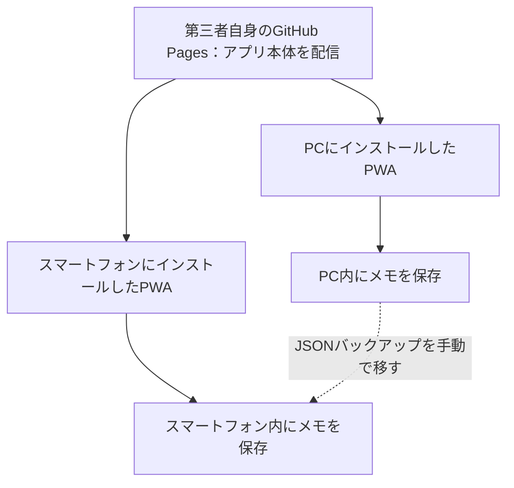

# ことばメモ インストール手順書

## 1. 最初に用意するもの

この手順書は、第三者が「ことばメモ」をPCとスマートフォンの両方へPWAとしてインストールし、各端末内にメモを保存して使うためのものです。アプリ作者のSupabaseには接続せず、利用者自身のSupabaseも不要です。

### 公開を準備する人に必要なもの

| 必要なもの | 用途・条件 |
| --- | --- |
| PC | GitHubでアプリのコピーと公開設定を行います。以下はWindowsを例にしています。 |
| EdgeまたはChrome | GitHubの操作とPCへのPWAインストールに使います。 |
| 自分のGitHubアカウント | 自分のアカウントにアプリをコピーし、GitHub Pagesで公開します。 |
| インターネット接続 | コピー、ビルド、公開、初回インストール、更新に必要です。 |
| アプリのソースコード | [kazunyon/situgosyou](https://github.com/kazunyon/situgosyou) からコピーします。 |

以下ではGitHubのブラウザ画面だけで公開を準備します。PCへのGit・Node.jsのインストールやコマンド入力は不要です。GitHub Freeでは公開リポジトリのGitHub Pagesを利用できます。公開されるのはアプリのソースと画面用ファイルで、端末内に登録したメモはリポジトリへ保存されません。[GitHub Pagesの公式説明](https://docs.github.com/en/pages/getting-started-with-github-pages/what-is-github-pages)

### インストールして使う人に必要なもの

| 必要なもの | 用途・条件 |
| --- | --- |
| PC | EdgeまたはChromeでPWAをインストールします。 |
| スマートフォン | AndroidはChrome、iPhoneはSafariを使います。 |
| 公開したアプリのHTTPS URL | 公開を準備した人から受け取ります。PCとスマートフォンで同じURLを開きます。 |
| 初回のインターネット接続 | アプリを読み込み、インストールします。 |
| バックアップファイルを保存する場所 | PCのフォルダー、スマートフォンの「ファイル」アプリなどを使います。 |

公開済みURLを受け取ってインストールするだけなら、GitHubアカウントも不要です。Supabaseのアカウント、接続キー、ログイン用メールアドレスも必要ありません。

手順は左手だけで進められるクリック・タップ中心です。文章の入力は片手で行えます。PCで貼り付けが必要な場合は、右クリックメニューの **貼り付け** を使えます。

## 2. サーバー無しで使える範囲

自分でアプリ用サーバーやデータベースを用意・運用せずに使えます。GitHub Pagesがアプリ本体の配信を担当し、メモとカテゴリは各端末のブラウザ内（`localStorage`）へ保存します。

**配信先も含めて完全にサーバーをゼロにする構成ではありません。** PWAをPCとスマートフォンへ届けるため、最初のインストールと更新にはHTTPSの配信先を使います。通常のPWAインストールは、ダウンロードした `index.html` を直接開く方法では行いません。

アプリ本体が端末に保存された後は、端末内モードでメモの表示・追加・編集・削除をオフラインでも行えます。ただし、端末やブラウザがアプリのキャッシュを削除した場合は、再度オンラインで読み込む必要があります。

**PCとスマートフォンのデータは別々です。** PCに登録したメモはスマートフォンへ自動で届きません。両方で同じ内容を使うときはJSONバックアップを手動で移します。同じブラウザアカウントでログインしても、このアプリのメモは自動同期されません。



## 3. 第三者自身のGitHubへアプリをコピーする

この章から第5章までは公開を準備する人が行います。アプリ作者のリポジトリや公開設定を変更する必要はありません。

1. PCで [GitHub](https://github.com/) を開き、自分のアカウントでログインします。
2. [元のリポジトリ](https://github.com/kazunyon/situgosyou) を開きます。
3. 右上の **Fork** をクリックします。
4. **Owner** が自分のアカウントになっていることを確認します。
5. **Repository name** は `situgosyou` のままにします。
6. **Copy the main branch only** が表示される場合はチェックします。
7. **Create fork** をクリックします。
8. コピー先が `自分のGitHubユーザー名/situgosyou` になったことを確認します。

Forkは自分のアカウントへソースコードのコピーを作る操作です。[GitHubのFork手順](https://docs.github.com/en/pull-requests/how-tos/work-with-forks/fork-a-repo)

以下ではGitHubユーザー名を `YOUR-USERNAME` と表記します。例えばユーザー名が `hanako` ならコピー先は `hanako/situgosyou` です。`YOUR-USERNAME` は文字どおりに入力せず、自分のユーザー名に読み替えます。

このアプリの [vite.config.ts](../vite.config.ts) は公開先のパスを `/situgosyou/` に設定しています。手順どおりの名前なら変更は不要です。すでに同名のリポジトリがある場合は、既存のものを削除せず、別名のコピーで `vite.config.ts` の `base` もその名前に合わせて変更します。

## 4. コピー先をSupabaseに接続しない設定にする

**操作するのは自分のコピー先です。** 作者のSupabaseのURLやキーをコピー先へ登録しません。

このアプリはビルド時に `VITE_SUPABASE_URL` と `VITE_SUPABASE_ANON_KEY` の両方に値があるとSupabaseへ接続します。端末内保存専用で公開するため、コピー先の公開処理では両方を空にします。

### 4-1. 公開処理の設定ファイルを編集する

1. 自分の `YOUR-USERNAME/situgosyou` の **Code** タブを開きます。
2. ファイル一覧の **.github → workflows → deploy-pages.yml** を順にクリックします。
3. 鉛筆の **Edit this file** ボタンをクリックします。
4. **Build** の下にある `env` の2行を、次のように変更します。

変更前：

```yaml
        env:
          VITE_SUPABASE_URL: ${{ secrets.VITE_SUPABASE_URL }}
          VITE_SUPABASE_ANON_KEY: ${{ secrets.VITE_SUPABASE_ANON_KEY }}
```

変更後：

```yaml
        env:
          VITE_SUPABASE_URL: ''
          VITE_SUPABASE_ANON_KEY: ''
```

5. 行頭の空白は変更前と同じにします。ほかの行はそのままにします。
6. **Commit changes…** をクリックします。
7. `main` に直接保存する選択肢を選び、**Commit changes** をクリックします。
8. 保存したファイルを開き、両方の値が `''` になっていることを確認します。

この設定なら、コピー先に同名のSecretsがあっても公開処理で参照しません。ソースにSupabase用のコードが含まれていても、接続設定が空ならクライアントは作成されず、保存先は端末内になります。

### 4-2. Supabaseの設定は登録しない

この手順ではSupabaseのSecrets、SQL、メール認証設定を登録しません。`.env.example` のサンプルURLやキーも設定しません。GitHubへ個人用の `.env.local` やメモのJSONバックアップをアップロードしないでください。

コピー先をPCへダウンロードして自分でビルドする場合は、GitHub Actionsの設定とは別に、PC側でもSupabaseの環境変数を空にする必要があります。この手順書ではGitHub Actionsでビルドするため、その作業は不要です。

## 5. 自分のGitHub Pagesへ公開する

### 5-1. 公開方法を設定する

1. 自分のコピー先の **Settings** をクリックします。
2. 左側の **Pages** をクリックします。
3. **Build and deployment → Source** で **GitHub Actions** を選びます。

### 5-2. 公開処理を実行する

1. リポジトリ上部の **Actions** をクリックします。
2. Forkしたworkflowの実行許可を求める画面が表示された場合は、内容を確認して有効化します。
3. 左側の **Deploy to GitHub Pages** をクリックします。
4. **Enable workflow** が表示される場合はクリックします。
5. **Run workflow** をクリックします。
6. ブランチが **main** になっていることを確認します。
7. 表示された **Run workflow** の実行ボタンをクリックします。
8. 新しい実行結果を開き、公開処理全体が緑色のチェックになるまで待ちます。

実行方法は [GitHubのworkflow手動実行手順](https://docs.github.com/en/actions/how-tos/manage-workflow-runs/manually-run-a-workflow) も参照できます。

### 5-3. 第三者用のURLを確認する

1. **Settings → Pages** を開きます。
2. 公開先として表示されたHTTPS URLを開きます。
3. 「ことばメモ」の画面が表示されることを確認します。
4. **「いまはこの端末だけの試作モードです」** と表示されることを確認します。この表示は端末内モードで動いている目印です。
5. メールアドレス入力欄、6桁コードの送信ボタン、ログイン後の同期表示がないことを確認します。

公開URLの形式は次のとおりです。

```text
https://YOUR-USERNAME.github.io/situgosyou/
```

例えば `hanako` さんなら `https://hanako.github.io/situgosyou/` です。**作者の公開URL `https://kazunyon.github.io/situgosyou/` は、第三者用のインストール先として使いません。** 作者の公開先がSupabase接続済みである可能性があるためです。

ここまで完了したら、自分の公開URLを利用者へ案内します。利用者は次の章から作業できます。

## 6. PCへPWAをインストールする

### 6-1. 公開URLを開く

1. PCで普段使うEdgeまたはChromeを開きます。
2. 第5章で確認した第三者用のHTTPS URLを開きます。
3. 端末内モードの表示があり、ログイン欄がないことを確認します。
4. アプリの画面が読み込まれるまで待ちます。

通常のブラウザウィンドウを使います。プライベート・InPrivate・シークレットモードは、保存を続ける用途には使いません。

### 6-2. インストールして起動する

1. アドレスバー右側付近にあるアプリの **インストール** アイコンをクリックします。
2. 確認画面で **インストール** をクリックします。
3. アプリ専用のウィンドウが開くことを確認します。
4. Windowsの **スタート** をクリックし、アプリ一覧で **ことばメモ** を確認します。
5. アプリをいったん閉じ、スタートの **ことばメモ** からもう一度開きます。

Edgeでインストールアイコンが見つからない場合は、右上の **… → アプリ** から、このサイトをアプリとしてインストールする項目を探します。Chromeでは右上のメニュー内でインストール項目を探します。ブラウザの版によって名称や場所は異なります。[PWAのインストール方法](https://developer.mozilla.org/en-US/docs/Web/Progressive_web_apps/Guides/Installing)

インストールに使ったブラウザとプロフィールを、その後も使います。別のブラウザからインストールすると別の保存領域になります。

## 7. スマートフォンへPWAをインストールする

PCへインストールしてもスマートフォンには自動で入りません。スマートフォンでも同じ第三者用URLを開き、個別にインストールします。

### 7-1. Androidの場合

1. スマートフォンの **Chrome** を開きます。
2. 第5章の第三者用HTTPS URLを開きます。
3. 端末内モードの表示があり、ログイン欄がないことを確認します。
4. 画面が読み込まれるまで待ちます。
5. 右上の **︙** メニューをタップします。
6. **アプリをインストール** または **ホーム画面に追加** をタップします。
7. 確認画面で **インストール** または **追加** をタップします。
8. ホーム画面またはアプリ一覧の **ことばメモ** をタップし、アプリが開くことを確認します。

LINEなどのアプリ内ブラウザでURLを開いた場合は、Chromeで開き直してから進めます。アイコンがあるだけで判断せず、第9章のオフライン起動も確認してください。

### 7-2. iPhoneの場合

1. iPhoneの **Safari** を開きます。
2. 第5章の第三者用HTTPS URLを開きます。
3. 端末内モードの表示があり、ログイン欄がないことを確認します。
4. 画面が読み込まれるまで待ちます。
5. **共有** ボタンをタップします。ページメニュー内にある場合は、そのメニューから **共有** を選びます。
6. 一覧をスクロールし、**ホーム画面に追加** をタップします。
7. **Webアプリとして開く** が表示される場合はオンにします。
8. **追加** をタップします。
9. ホーム画面の **ことばメモ** をタップして開きます。

**ホーム画面に追加** が見つからない場合は、共有メニューの **アクションを編集** から追加できるか確認します。[Appleのホーム画面への追加手順](https://support.apple.com/guide/iphone/bookmark-a-website-iph42ab2f3a7/ios)

メモの登録は、インストール後にホーム画面のアイコンから起動したPWAで行ってください。Safariの通常タブとインストールしたPWAでは保存領域が別になる場合があります。

## 8. PCとスマートフォンで最初のメモを登録する

最初はカテゴリが0件です。**両方の端末で次の操作をそれぞれ行います。** カテゴリの追加も端末ごとの保存です。

### 8-1. カテゴリを作る

1. インストールした **ことばメモ** を起動します。
2. 画面下の **設定** を押します。
3. **カテゴリを追加** を押します。
4. 名前の欄へ `確認用` と入力します。
5. **カテゴリを保存** を押します。
6. **カテゴリを保存しました** と表示されることを確認します。
7. 設定画面左上の戻るボタンを押します。

### 8-2. 日常用メモを作る

1. 画面下の **日常用** を押します。
2. **新しく書く** を押します。
3. PCではタイトルへ `PC確認メモ`、スマートフォンでは `スマホ確認メモ` と入力します。
4. 説明の入力欄へ `この端末に保存できました。` と入力します。
5. **確認用** のカテゴリを選びます。
6. 表示番号は自動で入った値を使います。
7. **保存** を押します。
8. **保存しました** と表示され、一覧に入力したタイトルと説明が表示されることを確認します。

ここでは説明を直接入力します。Wikipediaから説明を取得する **意味・説明** ボタンを押す必要はありません。

## 9. 第三者のインストール結果を確認する

以下は、実際に第三者の公開URL・PC・スマートフォンで行う確認手順と期待する結果です。**この手順書があることや、公開処理の緑色チェックだけでは、端末での動作確認が済んだことにはなりません。** 実際に操作した結果を第9-6節へ記録します。

### 9-1. 保存と再起動を確認する

1. 第8章でメモを保存したPWAを閉じます。
2. PCではスタート、スマートフォンではホーム画面のアイコンから起動し直します。
3. 作成したカテゴリとメモが残っていることを確認します。
4. メモの編集ボタンを押し、説明を `再起動しても保存されています。` に変更して保存します。
5. もう一度閉じて開き、変更した説明が残っていることを確認します。

PCとスマートフォンの両方で行います。成功の条件は、その場で見えるだけでなく、**閉じて開いた後にも保存内容が残ること**です。

### 9-2. PC/Linux用の登録を確認する

1. **PC/Linux用** を押します。
2. **操作項目を追加** を押します。
3. 操作項目の名前へ `操作手順の確認` と入力します。
4. **説明（必須）** へ `設定ボタンを押します。` と入力します。画像はなくても登録できます。
5. **保存** を押します。
6. 一覧の項目を開き、入力した手順が表示されることを確認します。
7. 閉じて開き直した後も、その項目と手順が残ることを確認します。

### 9-3. オフラインでの起動・保存を確認する

通信を切る前に、オンラインでPWAを一度起動し、日常用とPC/Linux用の画面が開けることを確認してから閉じます。

1. PCではタスクバーのネットワークのボタンからWi-Fiをオフにします。有線LANを使用している場合は、その接続も切ります。
2. スマートフォンでは設定やクイック設定から機内モードをオンにし、Wi-Fiもオフになっていることを確認します。
3. PWAのアイコンから **ことばメモ** を起動します。
4. 保存済みのメモと操作手順が表示されることを確認します。
5. 日常用の **新しく書く** から、タイトル `オフライン確認`、説明 `通信なしでも保存できました。` を登録します。
6. PWAを閉じて、通信を切ったまま開き直します。
7. `オフライン確認` が残っていることを確認します。
8. 確認後、通信の設定を元に戻します。

成功の条件は、**通信を切った状態での起動、表示、保存、再起動後の保持がすべてできること**です。Wikipediaからの説明取得はオフライン確認に含めません。音声入力・読み上げも端末や音声によって通信が必要になる場合があります。

### 9-4. PCとスマートフォンの保存先が独立していることを確認する

1. PCに `PC確認メモ`、スマートフォンに `スマホ確認メモ` があることを確認します。
2. PCだけに `PCだけ追加` を登録します。
3. スマートフォンのPWAを閉じて開き直します。
4. スマートフォンに `PCだけ追加` が自動では表示されないことを確認します。

この構成では、自動で表示されないことが期待する結果です。スマートフォンへ同じ内容を移す方法は第10章で説明します。

### 9-5. Supabaseへ接続していないことを確認する（公開を準備する人）

まず第4章の設定ファイルで2つの値が空のままであることを確認します。次にPCのブラウザで通信内容を確認します。

1. 自分の公開URLをEdgeまたはChromeの通常タブで開きます。
2. 右上のブラウザメニューから **その他のツール → 開発者ツール** を開きます。名称はブラウザによって異なります。
3. 開発者ツールの **Network（ネットワーク）** をクリックします。
4. 記録ボタンが停止している場合は記録を開始します。
5. ブラウザの再読み込みボタンをクリックします。
6. カテゴリとメモの追加・編集・保存を行います。この確認用タブ内のデータは、PWAの保存領域と同じとは限りません。
7. 通信一覧のフィルター欄に `supabase.co` と入力し、Supabaseへの要求が発生していないことを確認します。
8. 第4章の空の設定、端末内モードの表示、ログイン欄がないことも合わせて確認します。

このプロジェクトでは設定が空ならSupabaseのクライアント自体を作成しません。通信一覧だけで判断せず、公開した設定と画面の両方を確認します。作者のSupabaseへログインしたり、そのデータベースを開いて確認したりする必要はありません。

### 9-6. 確認結果を記録する

確認した人、日付、第三者用公開URL、PCのOSとブラウザ、スマートフォンのOSとブラウザを記録します。次の表の空欄へ、実際の結果を「成功」「失敗」「未実施」で記入してください。

| 確認項目 | 成功とする結果 | PCの実際の結果 | スマートフォンの実際の結果 |
| --- | --- | --- | --- |
| 端末内モード | 指定の表示があり、ログイン欄がない |  |  |
| PWAインストール | アイコンからアプリとして起動できる |  |  |
| カテゴリとメモの保存 | 登録した内容が一覧に出る |  |  |
| 再起動後の保持 | 閉じて開いてもカテゴリとメモが残る |  |  |
| 編集の保存 | 変更した説明が再起動後も残る |  |  |
| PC/Linux用 | 登録した操作手順が再起動後も残る |  |  |
| オフライン利用 | 通信なしで起動・保存・再起動後の保持ができる |  |  |
| 端末間の独立 | PCの追加がスマートフォンへ自動反映されない |  |  |
| バックアップと復元 | 第10章の復元後に件数と内容が合う |  |  |
| Supabaseへの非接続 | 公開設定が空で、確認操作中に接続要求がない |  | PCで公開設定と通信を確認 |

失敗した項目には操作、表示されたメッセージ、起きた時刻も記録します。スクリーンショットを残す場合は、個人のメモや個人情報が写っていない確認用データで撮影します。

## 10. PCとスマートフォンで同じメモを使う

自動同期の代わりにJSONバックアップで内容を移します。**復元は移行先の現在のメモとカテゴリを置き換えます。両方の変更を結合する機能ではありません。**

### 10-1. バックアップを保存する

1. 最新の内容がある端末のPWAで **設定** を開きます。
2. **バックアップ** を押します。
3. `ことばメモ_バックアップ_日付.json` が保存されたことを確認します。

JSONには日常用、PC/Linux用、操作手順の画像、カテゴリが含まれます。同じ日に複数回保存した場合は、保存時刻やファイル名を確認して最新のものを選びます。

### 10-2. ファイルをもう一方の端末へ移す

Androidでは、データ転送に対応したUSBケーブルでPCへ接続し、スマートフォン側で **ファイル転送** を選びます。PCのエクスプローラーからJSONファイルをスマートフォンの **Download** などへコピーできます。マウスの右クリックから **コピー** と **貼り付け** を使えます。

iPhoneでは、使い慣れたファイル転送方法でJSONファイルを「ファイル」アプリから選べる場所へ保存します。例えばPCとiPhoneの両方で利用できるiCloud Driveが使えます。この場合はファイルの受け渡しにiCloudを使いますが、アプリの自動同期先やSupabaseとして使うわけではありません。クラウドも使いたくない場合は、端末に対応したUSBストレージなど、ローカルでファイルを渡せる方法を用意します。

### 10-3. 移行先で復元して確認する

1. 移行先のPWAで **設定 → バックアップ** を押し、移行先の現在の内容も別のファイルとして保存します。
2. **バックアップを戻す** を押します。
3. 移してきたJSONファイルを選びます。
4. 確認画面に出るメモの件数を確認して復元を進めます。
5. 日常用のタイトルと説明、PC/Linux用の手順、カテゴリが元の端末と合うことを確認します。
6. 移行先のPWAを閉じて開き、復元内容が残っていることを確認します。

第9章の確認データで試す場合は、PCからバックアップを移すとスマートフォンにも `PC確認メモ` と `PCだけ追加` が表示されます。移行先だけに作った `スマホ確認メモ` は、そのPCのバックアップに含まれていなければ置き換えで消えます。

普段はPCを編集用、スマートフォンを閲覧用にするなど、最新の内容を持つ端末を決めておくと、古いバックアップで上書きする間違いを減らせます。

## 11. 現在の利用環境から移る場合

この章は、すでに自分のメモを保存している利用者だけが対象です。初めて使う第三者は第3章から新しく準備できます。

現在のSupabaseにある自分のメモを移す場合は、元のアプリで本人がログインし、**設定 → バックアップ** でJSONファイルを保存します。その後、自分の第三者用公開URLからインストールしたPWAで、第10章の手順で復元します。既存データは自動で移りません。

作者の個人データやアカウントを第三者へ渡す必要はありません。第三者は自分のメモを新規登録できます。元のアプリの接続先、Secrets、Supabaseのプロジェクトを変更・削除する作業も、この第三者用のインストール手順には含みません。

## 12. 更新とデータの保管

### アプリを更新する

公開を準備する人が自分のコピー先のソースを更新し、GitHub Actionsで再公開します。元のリポジトリから更新を取り込む場合は、**第4章で空にしたSupabase設定が元に戻っていないか確認してから公開します。** リポジトリ名と公開URLは維持します。

利用者はインターネットにつないでPWAを開き、必要に応じて閉じて開き直します。古い画面が続く場合は通常のブラウザで同じURLを再読み込みし、PWAも開き直します。更新前にはメモのバックアップを取ってください。

### メモを保管する

保存先は端末・ブラウザ・プロフィール・公開URLに依存します。別のブラウザや別のURLでは、同じメモが見えるとは限りません。サイトデータ削除、端末初期化、アプリ削除などで保存内容が失われる可能性があるため、重要な変更の後にはJSONバックアップを取り、端末故障でも取り出せる場所にもコピーを保管します。

画像を多く登録するとブラウザの保存容量に達する場合があります。保存エラーが出た場合は成功したと判断せず、既存データをバックアップしてから画像の大きさや件数を見直します。

Wikipediaから説明を取得する機能は、押したときだけタイトルをWikipediaへ送信します。音声入力・読み上げもブラウザや端末の仕様によって通信が必要です。これらはオフラインのメモ保存とは別の機能です。

## 13. うまくいかない場合

| 症状 | 確認すること |
| --- | --- |
| 公開URLが404になる | 自分のコピー先でPagesのSourceをGitHub Actionsにしたか、公開処理全体が成功したか確認します。Settings → PagesのURLを開きます。 |
| workflowが実行できない | Actionsの実行許可、Enable workflow、mainブランチの設定ファイルを確認します。 |
| ビルドでYAMLのエラーになる | 第4章の変更箇所の行頭の空白、コロン、引用符を確認します。 |
| 画面が白い、画像が出ない | リポジトリ名とvite.config.tsのbaseが合っているか確認します。この手順では両方ともsitugosyouを使います。 |
| ログイン欄が表示される | 作者のURLを開いていないか、自分のworkflowの値が両方空か確認します。再公開後、オンラインで開き直します。 |
| 「試作モード」と表示される | この手順では正常です。Supabaseを追加せず、そのまま利用します。 |
| 日常用メモを追加できない | 最初に設定からカテゴリを1件追加し、カテゴリを保存します。 |
| インストール項目が見つからない | HTTPS URL、通常ウィンドウ、対応ブラウザで開きます。すでにインストール済みなら既存のアイコンから起動します。スマートフォンはアプリ内ブラウザを避けます。 |
| オフラインで起動できない | 一度オンラインでPWAを起動してから第9-3節をやり直します。キャッシュが削除されていないか確認します。 |
| PCのメモがスマートフォンへ出ない | 自動同期はありません。第10章のバックアップと復元で手動移行します。 |
| 再起動後にメモが見えない | インストールした同じPWAを使っているか、別のブラウザ・プロフィール・URLになっていないか確認します。保存エラーやサイトデータ削除の有無も確認します。 |
| 復元ファイルを選べない | JSONファイルが端末へダウンロードされ、ファイル選択画面から開ける場所にあるか確認します。 |
| 復元したら元のメモが消えた | 復元は置き換えです。復元前に保存した移行先のバックアップから戻します。 |
| 古い画面が出る | オンラインで公開URLを再読み込みし、PWAを閉じて開き直します。 |

## 14. この手順の確認根拠

端末内モードの分岐、画面表示、カテゴリの初期状態、バックアップの内容は以下のソースコードに基づいています。実際のPC・スマートフォンでの結果は第9章の操作で確認してください。

- [src/supabase.ts](../src/supabase.ts)：接続設定がない場合はSupabaseのクライアントを作成しません。
- [src/storage.ts](../src/storage.ts)：端末内のメモ保存、バックアップ、置き換え復元を行います。
- [src/categories.ts](../src/categories.ts)：端末内のカテゴリ保存を行い、初期状態はカテゴリ0件です。
- [src/App.tsx](../src/App.tsx)：端末内モードの表示と登録・設定画面のボタンを定義しています。
- [vite.config.ts](../vite.config.ts)、[src/main.tsx](../src/main.tsx)：PWAの設定とService Workerの登録を行います。
- [deploy-pages.yml](../.github/workflows/deploy-pages.yml)：GitHub Pagesへのビルド・公開を行います。第三者のコピー先では第4章の変更を適用します。

アプリの機能全体は [README](../README.md) を参照してください。READMEに記載された作者の公開URLやSupabase同期の説明と、この手順の第三者用公開URL・端末内保存の設定を混同しないでください。
